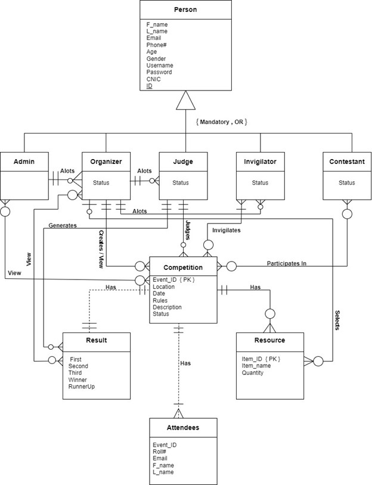
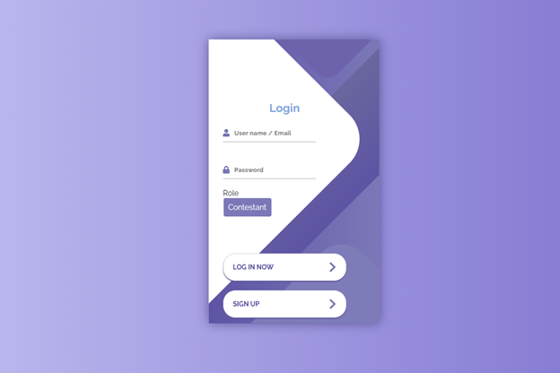
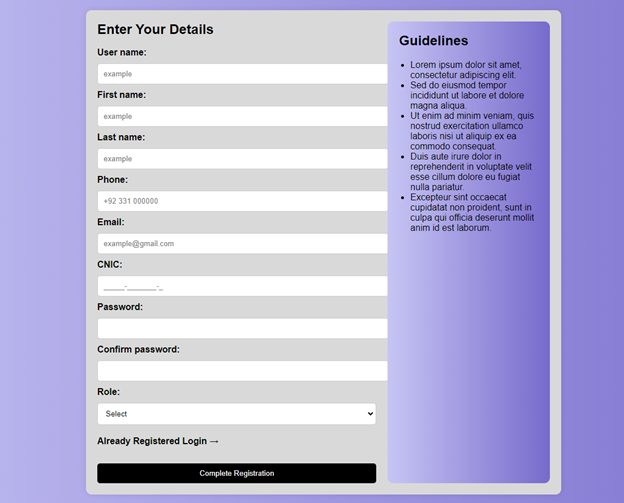
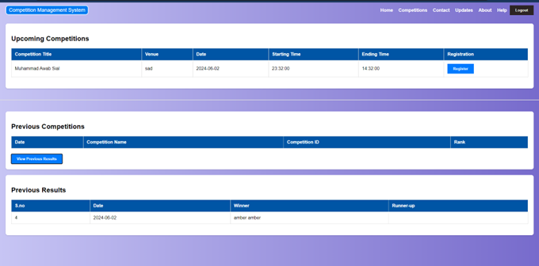

# 🏆 Competition Management System


---

## 📌 Overview

**Competition Management System** is a comprehensive database-driven application developed using **C++ and Qt**, designed as a semester project for the **Database Management Systems (DBMS)** course at **Bahria University Islamabad Campus**.

The system centralizes the management of competitions, including participant registration, judge evaluation, result reporting, and administrative control — all within a secure, user-friendly GUI.

---

## ✨ Features

* 📝 **Registration Management** for participants and teams
* 🧑‍⚖️ **Judge Assignment & Evaluation System**
* 🔍 **Search Functionality** for contests, results, and users
* 📊 **Reporting & Analytics** on performance and issues
* 🧑‍💼 **Role-Based Access** (Admin, Judge, Invigilator, Organizer, Participant)
* 📁 **Centralized Database** with backup and recovery

---

## 🎯 Project Objectives

* Develop a robust system to manage end-to-end competition workflows
* Eliminate inefficiencies of manual event handling
* Provide role-based access to different stakeholders
* Maintain historical data and records for future reference
* Implement a secure, scalable architecture with integrity constraints

---

## 👥 System Users

* **Organizers**: Manage competitions, assign duties, and handle registration
* **Admins**: Ensure system security, backup, and database integrity
* **Contestants**: Register and view competition schedules & results
* **Judges**: Evaluate contestants and provide feedback
* **Invigilators**: Monitor duties and event timings

---

## 🔧 Core Functionalities

* **Competition Lifecycle**: Add, update, and delete competitions
* **Participant Handling**: Register individual or team-based entries
* **Judging System**: Provide scores and feedback per competition
* **Search Operations**: Filter contests, judges, past results, etc.
* **Reporting**: Generate analytics on event outcomes and fairness

---

## 📁 Project Directory

```
Competition-Management-System/
│── Website/                   # Folder containing all the PHP code
│── Block And Arrow Diagram.jpg
│── Block Diagram.png
│── Dashboard.png
│── ERD.jpg
│── Login.png
│── Project Report.docx        # Detailed Project Report
│── README.md                  # Documentation
│── Signup.png

```


## 🧠 System Architecture

### 📊 ERD Diagram



### 🧱 Block Diagram


### 🔁 Block & Arrow Diagram


---

## 🖼️ GUI Screenshots

### 🔐 Login Page



### 📝 Signup Page



### 📊 Dashboard



---

---

## 📢 LinkedIn Showcase

📹 Watch the demo and see project highlights on our official post:
[🔗 LinkedIn Project Showcase](https://shorturl.at/mjjsO)

---

## 📜 License

This project is developed exclusively for academic purposes under the **DBMS Semester Project** at **Bahria University, Islamabad Campus**.

---

## 🙌 Acknowledgments

* **Instructor:** Ms. Sara Durrani, MS Fatima Khalique 

* **Submitted By:**

  * Muhammad Awab Sial (01-134222-091)
  * Syed Amber Ali Shah (01-134222-146)
  * Shehroz Zahid (01-134222-141)
* **Class:** BS-CS 4B
* **Session:** Spring 2024


